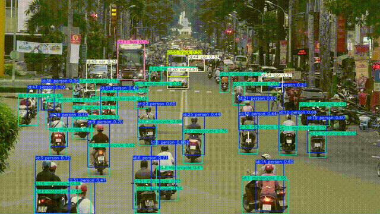

# 🎯 YOLOv8 Multi-Object Tracking with BoT-SORT

Track multiple objects in video streams using YOLOv8 + BoT-SORT with efficient batching and dynamic motion visualization.


---

## 🔍 Overview

This repository provides a clean, efficient, and scalable pipeline to perform **multi-object tracking** on videos using **Ultralytics YOLOv8** and **BoT-SORT**.

**Key Features**:

- ✅ YOLOv8 inference with persistent BoT-SORT tracking  
- 🧵 Batch processing for performance  
- 🎞️ Historical motion trails per object  
- ⚙️ Modularized, extensible Python codebase  
- 💻 Works both locally and on Google Colab (with GPU)

---

## 🧩 Folder Structure

```bash
Object-Tracking/
├── main.py                   # Main tracking script
├── requirements.txt          # Python dependencies
├── models/                   # Pretrained YOLO models
│   └── yolo11x.pt
├── samples/                  # Input video files
│   └── vietnam.mp4
├── outputs/                  # Output tracking videos
│   └── vietnam_tracked.mp4
├── assets/                   # Visual outputs for README
│   └── tracking_preview.gif
├── src/
│   └── utils.py              # Logging/helper functions
├── notebooks/
│   └── Object_Tracking.ipynb # Google Colab-ready notebook
└── README.md
````

---

## 🚀 Quick Start

### 1️⃣ Clone and Install

```bash
git clone https://github.com/CryptolWhile/Object-Tracking.git
cd Object-Tracking
pip install -r requirements.txt
```

> 💡 *Optional: Use a Python virtual environment for isolation.*

---

### 2️⃣ Add Inputs

* 🎥 Add your input video to `samples/` (e.g., `vietnam.mp4`)
* 🧠 Add your YOLO model (e.g., `yolo11x.pt`) to `models/`

---

### 3️⃣ Run Locally

```bash
python main.py --video-path samples/vietnam.mp4
```

🎬 Output video will be saved to:
`outputs/vietnam_tracked.mp4`

---

### ☁️ Run on Google Colab

Use our [Google Colab notebook](notebooks/Object_Tracking.ipynb) to:

* ✅ Run inference with GPU (free)
* ✅ Upload model & video from Google Drive
* ✅ Output results to Drive
* ✅ Convert MP4 to GIF easily for preview

---

## ⚙️ Configuration

You can change configuration in `main.py` (or abstract to a config file):

```python
return {
    "model_path": "models/yolo11x.pt",
    "track_history_length": 120,
    "batch_size": 64,
    "line_thickness": 4,
    "track_color": (230, 230, 230),
}
```

> To process full video instead of just 3 seconds:

```python
frames_to_process = int(cap.get(cv2.CAP_PROP_FRAME_COUNT))
```

---

## 📦 Requirements

```
ultralytics==8.3.162
opencv-python==4.11.0
numpy==2.0.2
tqdm==4.67.1
PyYAML==6.0.2
```

Install all:

```bash
pip install -r requirements.txt
```

---

## 🎬 Example Output

<p align="center">
  
</p>


## 📄 License

MIT License — See [`LICENSE`](LICENSE)

---

## 🌟 Contribute

Pull requests, issues, and suggestions are welcome.
If you found this project helpful, **please ⭐ it on GitHub** — it really helps!

---
